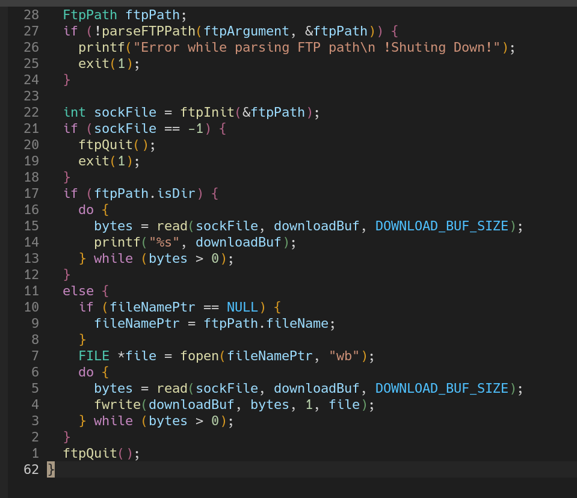

# Usage

- `$ make` vai criar o executável `download`

- **Listar** o diretório de um servidor ftp.
```bash
./download ftp://[user:password@]host/url/para/diretorio 
```

- Fazer **download** de um ficheiro num servidor ftp.
```bash
./download ftp://[user:password@]host/url/para/ficherio [novo-nome-para-o-ficheiro]
```


# Error Handeling

Como vamos ver nos exemplos, se um erro acontece e a ligação ao servidor está estabelecida,o programa é sempre capaz de desligar a conexão.

- Incorrect URL

- Could not Resolve IP address

- Failed To Open Directory

- Failed To Open File

- Wrong Login 


# Estrutura Do Projeto

```
.
├── ftpPath.c
├── ftpPath.h
│
├── ftpReply.c
├── ftpReply.h
│
├── ftpClient.c
├── ftpClient.h
│
└── download.c
```

- `ftpPath.h`: api que dá parse a uma string contendo um URL de um servidor FTP
- `ftpReply.h`: api que permite criar mensagens e receber de respostas de várias linhas do servidor.
- `ftpClient.h`: api que cria uma cliente FTP e implementa as funcoes **download**, e **listing**.
- `download.c`: aplicacao de download que usa o cliente implementado.

## Interface de ftpPath

`ftpPath.h` define a api para dar parse a um URL de um servidor ftp:

```c
typedef struct ftp_path FtpPath;

void printFtpPath(FtpPath* ftpPath);
int parseFTPPath(const char* ftpString, FtpPath* ftpPath);
```

## Interface de ftpReply
```c
#define NICEPRINT "------> "

#ifdef PRINT_COMMUNICATION
#define print_communication(...) printf(__VA_ARGS__)
#define print_reply(...) printf("%s", NICEPRINT);printf(__VA_ARGS__)
#else
#define print_communication(...)
#define print_reply(...)
#endif

extern char ftp_ReplyCode[4];

void ftpSafeReadMessage(int sockfd,char* buf,int size);
void ftpCreateMessage(char *dest, const char *command, const char *arg);
```
- No passo de compilação podemos não definir `PRINT_COMMUNICATION` e iremos
  assim desativar a impressão da comunicação entre o cliente e o servidor (para
  o caso de aplicações que queiram fazer algo mais complexo com este cliente)
- `print_reply` é uma macro usada para imprimir as respostas do cliente
- `ftp_ReplyCode` é uma variável declarada como `extern` para imitar o estilo
  de códigos que usa a `libc` com coisas como `errno` e `h_errno`, pode ser
  acedida depois da chamada a `ftpSafeReadMessage`.
- `ftpSafeReadMessage` lê sempre toda a mensagem que o servidor mandou
  independentemente do tamanho do buffer dado ou a mensagem ser **multiline**.
- `ftpCreateMessage` cria uma  mensagem FTP em `dest` com o comandando e o argumento dado.

## Interface de ftpClient

```c
#include "ftpPath.h"
int ftpInit(FtpPath *ftpPath);
int ftpQuit();
```

- `ftpInit(FtpPath *ftpPath)`: recebe um apontador para um FtpPath que é o
  resultado de dar parse de um URL FTP.A função implementa um cliente de FTP em
  modo passivo e retorna o file descriptor do socket de leitura.
  O que vai ler do socket depende do URL que lhe passamos:
  - Url de um ficheiro: o conteúdo do ficheiro.
  - Url de um diretório: o conteudo do diretório.
  Obtendo assim flexibilidade de dar `ls` de um diretório no servidor bem como fazer o download de um ficheiro do mesmo.

- `ftpQuit()`: fecha a conexao ftp enviando `quit` para o socket de controlo e fecha os dois sockets

Isto é tudo que um usuário do nosso cliente de ftp,
precisa de saber pois o resto é abstraido e está contido em ficheiros de implementacao (`.c`) que
contem a maior parte da complexidade do trabalho.

# Download 

Como providenciamos esta interface tão simples o seu uso acaba por ser bastante legível e idiomático:



Nestas 30 linhas de código:
- Damos parse à string que contem o URL 
- Obtemos o fileDescriptor de onde vamos ler
- Se estivermos a trabalhar com um diretório damos print no terminal do seu conteudo.
- Se estivermos a trabalhar com um ficheiro criamos um ficheiro com o nome
  especificado no URL ou com outro nome que o user passe como argumento.


# Notas

- Foram omitidos alguns detalhes de implementação nesta overview do código.
